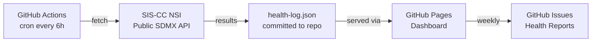

# statpulse

[](https://github.com/erenkahraman/statpulse/actions/workflows/health-check.yml)
[](https://erenkahraman.github.io/statpulse)
[](LICENSE)

**Real-time API health monitoring for the SIS-CC .Stat Suite SDMX platform.**

## What is this?

I built statpulse to demonstrate production-grade platform observability skills in the context of the SIS-CC .Stat Suite — the open-source SDMX dissemination platform that powers OECD's Data Explorer, country NSIs, and international statistical organisations.

Every six hours, a GitHub Actions workflow calls three public, auth-free SDMX REST API endpoints on the SIS-CC demo environment. The results — HTTP status, response time, content-type validity, and domain-specific metrics like DSD catalogue size — are committed back to this repository as `data/health-log.json`. A self-contained GitHub Pages dashboard reads that file directly and renders uptime percentages, response-time charts, anomaly detection alerts, a Catalogue Change Report with timeline and snapshot table, a live SDMX Artefact Browser, a Dataflow Explorer, an interactive SDMX Guide Panel, and weekly automated health reports as GitHub Issues.

No backend. No database. No cloud bill.

This is also a portfolio project for an OECD SDD/SDPS Product Manager role — it demonstrates hands-on familiarity with SDMX artefacts, the .Stat Suite module architecture, GSBPM-aligned data lifecycle thinking, and the kind of automated governance tooling a PM should be able to commission and own.

## Why I Built This

Rather than describing these capabilities in a cover letter, I built a working system that exercises them directly — using AI-assisted development to accelerate implementation while owning all architectural decisions, domain research, and product thinking. The project is a practical demonstration of the skills required for the OECD SDD/SDPS Product Manager role.

### How statpulse maps to the role requirements

| Role Requirement (from JD) | How this project addresses it |
|---|---|
| "Collect, analyse and identify user's behavioural patterns through usability tests, users surveys/feedback and analytics" | The KPI framework in `governance/kpis.yaml` defines 6 measurable indicators — including WCAG compliance and community issue resolution time — that mirror the analytics-driven product feedback loop described in the role |
| "Develop and monitor key performance indicators to assess user satisfaction and product quality in terms of functions, accessibility, performance, scalability and security" | `governance/kpis.yaml` defines structured, machine-readable KPIs with targets, measurement methods, and owners. The automated health-check pipeline operationalises two of them (api-availability, api-response-time) with real data collected every 6 hours |
| "Oversee, coordinate and continuously improve the lean/agile development process with the developers ensuring the successful and efficient delivery of high-quality solutions" | The GitHub Actions CI/CD pipeline, Conventional Commits discipline, and issue templates (user stories with Definition of Done, SDMX artefact change requests) reflect the Agile delivery process a PM would own and continuously improve |
| "Perform quality assurance testing to ensure the correct functioning of the products, incl. accessibility, contribute to develop related automated tests, and define acceptance criteria" | The health-check script performs automated API validation on every run — checking HTTP status, SDMX content-type headers, and response time thresholds. An automated axe-core accessibility audit pipeline enforces WCAG 2.1 AA compliance as a CI gate (0 critical violations). Acceptance criteria are embedded in the user-story issue template |
| "Excellent experience is required with the DevSecOps platform GitLab or GitHub and its issue, epic, board, milestone, pipeline, runner, dashboard and analytics management tools" | This project is built entirely on GitHub's DevSecOps surface: Actions pipelines, scheduled runners, Pages deployment, issue templates with labels, and a data-driven dashboard — all configured from scratch |
| "Familiarity with Statistical Data and Metadata eXchange (SDMX) standard with a commitment to reach a good working knowledge" | The monitoring script parses live SDMX-ML XML responses, counting DataStructure and Codelist artefacts. The governance layer references SDMX-specific concepts: DSDs, Codelists, Content Constraints, the NSI web service, and the Transfer service `/init/dataflow` endpoint |
| "Good experience working with analytical tools and key indicator dashboards, such as Google Analytics, PowerBi and Grafana" | The GitHub Pages dashboard is a purpose-built observability tool: real-time uptime cards, Chart.js response-time visualisation, domain metric trend tables, and anomaly detection alerts — conceptually equivalent to a Grafana dashboard, implemented without infrastructure cost |
| "Contribute to setting up collaboration frameworks and best practices with SIS-CC members" | `.github/ISSUE_TEMPLATE/` includes three structured templates (user stories, SDMX artefact change requests, API health alerts) that codify collaboration norms — the same kind of framework a PM would establish with SIS-CC community members |
| "Provide regular reporting as required" | The automated weekly report workflow opens a GitHub Issue every Monday with platform health metrics — uptime percentage, average response times, catalogue stability — structured as a stakeholder-ready summary |
| "Innovate and Embrace Change (Level 2)" | The entire project was built using AI-assisted development (Claude Code), with architectural decisions, domain research, and product framing owned by me. Using AI as a productivity multiplier while maintaining quality ownership is precisely the kind of innovation this competency describes |

*Built with Claude Code (Anthropic) — AI-assisted implementation, human-directed architecture and product thinking.*

## Architecture



## Dashboard Features

| Feature | Description |
|---|---|
| Platform Health Score | Composite 0–100 score (availability 50%, response time 30%, anomaly-free 20%) with letter grade and score breakdown bars |
| Endpoint Status Cards | Live uptime % and response time per SDMX endpoint with operational/degraded/down badge |
| Response Time Chart | Last 20 checks as a Chart.js line chart per endpoint |
| Anomaly Detection | 10-check rolling average — flags 2× (warning) and 3× (critical) deviations |
| Domain Metric Trends | DSD count, response KB, Codelist count over time |
| SDMX Artefact Browser | Live searchable, sortable DSDs and Codelists tabs fetched directly from the NSI endpoint |
| Dataflow Explorer | Browse and search all available SDMX dataflows on the SIS-CC demo instance |
| Catalogue Change Report | Timeline of structural catalogue changes with 10-check snapshot table (Timestamp, DSDs, Codelists, Change delta) |
| Tabbed Reports Interface | Weekly Health Reports and Catalogue Changes in a unified tabbed section |
| Weekly Health Reports | GitHub Issues auto-generated every Monday 09:00 UTC |
| SDMX Guide Panel | Toggleable 3-tab overlay covering platform architecture, SDMX concepts, and dashboard usage |
| Accessibility Status Banner | Live WCAG 2.1 AA status — 0 critical, 0 serious violations; links to full audit report |
| GitHub Header Link | Direct link to this repository from the dashboard header |

## Monitored Endpoints

| Endpoint | URL | What I measure |
|---|---|---|
| Structures | `https://nsi-demo-stable.siscc.org/rest/datastructure/all/all/all?detail=allstubs` | Uptime, response time, DSD catalogue count |
| Data Query | `https://nsi-demo-stable.siscc.org/rest/data/OECD.CFE,INBOUND@TOURISM_TRIPS,2.0` | Uptime, response time, response size KB |
| Codelists | `https://nsi-demo-stable.siscc.org/rest/codelist/all/all/latest?detail=allstubs` | Uptime, response time, Codelist catalogue count |

All three endpoints are public and require no authentication — they represent the live SIS-CC demo environment.

## Product Management Layer

The `governance/` directory contains the artefacts a PM owns alongside the code:

| File | Purpose |
|---|---|
| `governance/kpis.yaml` | Six measurable KPIs tied to platform reliability, data quality, accessibility, and community health |
| `governance/dsd-audit-checklist.md` | Pre-promotion checklist for SDMX Data Structure Definitions |
| `governance/data-lifecycle.md` | GSBPM-aligned end-to-end data lifecycle with Mermaid flowchart |
| `governance/accessibility-audit.md` | WCAG 2.1 AA compliance report — automated axe-core scan, 0 critical violations |
| `governance/user-research/` | Usability test plan (5-task moderated sessions), SUS survey questions, GA4 analytics tracking plan |

Issue templates in `.github/ISSUE_TEMPLATE/` cover user stories, SDMX artefact change requests, and API health alerts.

## KPIs Tracked

| KPI | Target | Frequency |
|---|---|---|
| API Availability | ≥ 99.5% | Every 6h |
| API Response Time (p95) | < 3000ms | Every 6h |
| SDMX Content-Type Validity | 100% | Every 6h |
| DataStructure Catalogue Stability | ±5 of 30-day rolling avg | Daily |
| Dashboard WCAG 2.1 AA | Zero critical violations | Per PR |
| Community Issue Resolution | Bugs < 30d, Features < 90d | Monthly |

*Catalogue stability is now tracked with per-check granularity via the Catalogue Change Report tab in the dashboard.*

## Local Development

```bash
# Clone the repository
git clone https://github.com/erenkahraman/statpulse.git
cd statpulse

# No runtime dependencies — Node 20 built-in fetch handles everything
npm install

# Run a health check manually and populate health-log.json
npm run check

# Run the WCAG 2.1 AA accessibility audit (requires Chrome/Chromium)
npm run audit:a11y
# Output: governance/accessibility-audit.md

# Preview the dashboard locally (copy data file alongside HTML)
cp data/health-log.json dashboard/health-log.json
# Open dashboard/index.html in your browser
open dashboard/index.html
```

Node.js 20 or later is required. The script uses the built-in `fetch` API — no `node-fetch` or other HTTP libraries needed.

## About .Stat Suite

[.Stat Suite](https://sis-cc.gitlab.io/dotstatsuite-documentation/) is the SIS-CC open-source platform for statistical data dissemination. It implements the SDMX standard and consists of several modules:

- **.Stat Core** — the NSI (National Statistics Institute) component that exposes the SDMX REST API
- **Data Lifecycle Manager (DLM)** — governance UI for creating and versioning SDMX artefacts
- **Data Explorer (SDE)** — end-user data discovery and download interface
- **Search & Facet Service (SFS)** — indexing and faceted search engine

statpulse monitors the .Stat Core REST API layer, which is the shared foundation all other modules depend on.

## Contributing

I welcome issues, ideas, and pull requests. Use the issue templates in `.github/ISSUE_TEMPLATE/` to structure requests — the API health alert template is especially useful if you spot a monitoring gap.

## Changelog

### v1.4.0 — February 2026

- Automated WCAG 2.1 AA accessibility audit pipeline (`scripts/accessibility-audit.js`, axe-core + Puppeteer, GitHub Actions workflow)
- Dashboard accessibility fixes: resolved `aria-hidden-focus` and `color-contrast` violations — 0 critical, 0 serious remaining
- WCAG 2.1 AA status banner added to dashboard (links to `governance/accessibility-audit.md`)
- User research templates: usability test plan, SUS survey, GA4 analytics tracking plan (`governance/user-research/`)
- Docs directory: onboarding guide, add-new-endpoint tutorial, product decision log (`docs/`)
- Catalogue Change Report: replaced Chart.js sparkline with stable HTML snapshot table (last 10 checks)
- GitHub repository link added to dashboard header

### v1.3.0 — February 2026

- Catalogue Change Report: timeline view of DSD and Codelist changes with delta tables
- SDMX Artefact Browser: live searchable, sortable table of DSDs and Codelists fetched directly from nsi-demo-stable.siscc.org
- SDMX Guide Panel: toggleable overlay with three-tab reference guide covering platform architecture, SDMX concepts, and dashboard usage
- Tabbed report interface: Weekly Health Reports and Catalogue Changes in a unified reports section
- Anomaly detection: rolling average deviation alerts at 2× and 3× thresholds

### v1.2.0 — February 2026

- Anomaly detection with configurable rolling average window
- Weekly automated platform health reports as GitHub Issues
- Interactive report viewer fetching GitHub Issues API

### v1.1.0 — 2026

- Rolling-average anomaly detection with warning/critical severity levels
- Automated weekly platform health report as a GitHub Issue every Monday
- Job description alignment section in README

### v1.0.0 — 2025

- Initial release: three-endpoint SDMX monitoring via GitHub Actions
- Self-contained GitHub Pages dashboard with Chart.js response-time visualisation
- Governance layer: KPI framework, DSD audit checklist, GSBPM lifecycle diagram
- Issue templates for user stories, SDMX artefact changes, and health alerts

## Documentation

| File | Purpose |
|---|---|
| [`docs/onboarding-guide.md`](docs/onboarding-guide.md) | Getting started with statpulse — dashboard sections, alert interpretation, manual checks, and escalation decision tree |
| [`docs/add-new-endpoint.md`](docs/add-new-endpoint.md) | How to extend monitoring to new .Stat Suite instances — step-by-step with real code snippets |
| [`docs/product-decision-log.md`](docs/product-decision-log.md) | Architectural decision rationale — GitHub Issues reporting, JSON health log, rolling anomaly detection, snapshot table |
| [`governance/user-research/usability-test-plan.md`](governance/user-research/usability-test-plan.md) | 5-task moderated usability test plan with SUS metrics and session structure |
| [`governance/user-research/survey-questions.md`](governance/user-research/survey-questions.md) | SUS questionnaire, task-satisfaction survey, in-product popup, and accessibility feedback |
| [`governance/user-research/analytics-tracking-plan.md`](governance/user-research/analytics-tracking-plan.md) | GA4 event schema, KPI dashboard config, and EU privacy compliance checklist |
| [`governance/accessibility-audit.md`](governance/accessibility-audit.md) | WCAG 2.1 AA compliance report — automated axe-core scan, 0 critical violations |

---

*Built as a portfolio project for OECD SDD/SDPS PM role | Not officially affiliated with OECD or SIS-CC*
