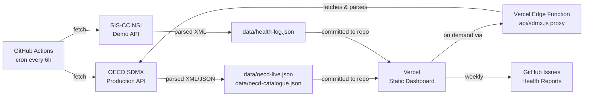

# StatPulse — OECD SDMX Intelligence Platform

[](https://github.com/erenkahraman/statpulse/actions/workflows/health-check.yml)
[](https://statpulse.erenkahraman.work)
[](LICENSE)

Real-time monitoring and data intelligence for the OECD SDMX ecosystem.

---

## What is StatPulse?

StatPulse monitors and visualizes live data from the OECD SDMX production API and the SIS-CC .Stat Suite demo environment. It is designed as a small, inspectable open source platform for understanding API health, catalogue coverage, and time-series data availability across OECD statistical services.

The platform currently covers five production OECD endpoints: Composite Leading Indicators, Monthly Unemployment Rates, GDP, Health SHA, and the full OECD dataflow catalogue. It also monitors three SIS-CC demo endpoints. Automated health checks run every six hours through GitHub Actions and commit the resulting JSON snapshots back to the repository.

Beyond monitoring, StatPulse provides an interactive chart viewer for SDMX datasets, a searchable browser of 2,527 OECD dataflows across 47+ agencies, and dataset coverage across Economics, Labour, Education, Finance, and Digital & Innovation categories. It is built with Vercel static hosting and Edge Functions, GitHub Actions, Lightweight Charts, and Chart.js. There is no database and no long-running backend service.

---

## Live Platform

https://statpulse.erenkahraman.work

The live dashboard opens on a platform overview with API availability, indexed dataset counts, latest observation metrics, anomaly status, and key economic indicators. From there, you can browse live OECD production endpoints, search the full data catalogue, inspect dataset metadata, open SDMX time-series charts, review automated reports, and read governance documentation from the same interface.

---

## Architecture


```mermaid
flowchart LR
    A[GitHub Actions\ncron every 6h] -->|fetch| B[OECD SDMX\nProduction API]
    A -->|fetch| C[SIS-CC NSI\nDemo API]
    B -->|parsed XML/JSON| D[data/oecd-live.json\ndata/oecd-catalogue.json]
    C -->|parsed XML| E[data/health-log.json]
    D -->|committed to repo| F[Vercel\nStatic Dashboard]
    E -->|committed to repo| F
    F -->|on demand via| G[Vercel Edge Function\napi/sdmx.js proxy]
    G -->|fetches & parses| B
    F -->|weekly| H[GitHub Issues\nHealth Reports]
```

---

## Features

### Monitoring

| Feature | Description |
|---|---|
| OECD production monitoring | Five OECD production endpoints are checked every six hours. |
| SIS-CC demo monitoring | Three .Stat Suite demo endpoints are checked for uptime, latency, and SDMX response shape. |
| Anomaly detection | A 10-check rolling average flags 2x warning and 3x critical response-time deviations. |
| Weekly health reports | GitHub Issues are generated automatically with platform health summaries. |
| KPI scorecard | Tracks availability, p95 response time, anomaly rate, catalogue coverage, report cadence, and data freshness. |

### Data Intelligence

| Feature | Description |
|---|---|
| Universal SDMX chart viewer | Fetches OECD SDMX dataflows and renders them as interactive time series with Lightweight Charts. |
| Dimension grouping | Supports grouping by SDMX dimensions such as `REF_AREA`, `MEASURE`, and `FREQ`. |
| Time range controls | Provides 1Y, 5Y, 10Y, and All range filters for visible series. |
| Chart types | Supports line, area, and bar views. |
| CSV export | Downloads the currently visible chart data with date, series, and value columns. |
| Serverless proxy | `api/sdmx.js` removes CORS friction, centralizes XML parsing, and enforces payload limits. |

### Data Coverage

| Category | Datasets | Source |
|---|---|---|
| Economics & Growth | GDP — Expenditure Approach, Composite Leading Indicators | OECD.SDD.NAD, OECD.SDD.STES |
| Labour & Social | Monthly Unemployment Rates, Health Expenditure (SHA) | OECD.SDD.TPS, OECD.ELS.HD |
| Education | Government Education Budget, Public Service Satisfaction | OECD.EDU.IMEP, OECD.GOV.GIP |
| Finance & Households | Household Economic Indicators | OECD.SDD.NAD |
| Digital & Innovation | R&D Expenditure (MSTI), ICT Usage by Businesses | OECD.STI.STP, OECD.STI.DEP |

### Catalogue

| Feature | Description |
|---|---|
| Full OECD catalogue | Indexes 2,527 dataflows across 47+ agencies. |
| Search and filtering | Filters catalogue rows by keyword and agency. |
| Dataset inspection | Opens a detail panel for any selected dataflow. |
| Modal browser | Provides paginated catalogue browsing with 50 rows per page. |
| CSV export | Exports the full catalogue for offline review. |

### Governance

| Feature | Description |
|---|---|
| Accessibility audit | WCAG 2.1 AA audit using axe-core and Puppeteer, wired into CI. |
| KPI framework | `governance/kpis.yaml` defines measurable reliability, quality, accessibility, and freshness indicators. |
| Data lifecycle documentation | GSBPM-aligned lifecycle notes describe how SDMX data moves through the system. |
| User research templates | Includes a usability test plan, SUS survey, and GA4 analytics tracking plan. |
| Issue templates | Structured templates cover user stories, SDMX artefact changes, and API health alerts. |

---

## Monitored Endpoints

### OECD Production API (sdmx.oecd.org)

| Dataset | Agency | Dataflow | Frequency |
|---|---|---|---|
| Composite Leading Indicators | OECD.SDD.STES | DSD_STES@DF_CLI | Monthly |
| Monthly Unemployment Rates | OECD.SDD.TPS | DSD_LFS@DF_IALFS_UNE_M | Monthly |
| GDP — Expenditure Approach | OECD.SDD.NAD | DSD_NAAG@DF_NAAG_I | Annual |
| Health Expenditure (SHA) | OECD.ELS.HD | DSD_SHA@DF_SHA | Annual |
| Full Dataflow Catalogue | OECD | all | On demand |

### SIS-CC .Stat Suite Demo (nsi-demo-stable.siscc.org)

| Endpoint | URL path | What is measured |
|---|---|---|
| Structures | `/rest/datastructure/all/all/all` | Uptime, response time, DSD count |
| Data Query | `/rest/data/OECD.CFE,INBOUND@TOURISM_TRIPS,2.0` | Uptime, response time, KB |
| Codelists | `/rest/codelist/all/all/latest` | Uptime, response time, Codelist count |

---

## Tech Stack

| Layer | Technology |
|---|---|
| Hosting | Vercel static hosting and Edge Functions |
| CI/CD | GitHub Actions |
| Data storage | JSON files committed to the repository |
| Charts | Lightweight Charts v4.1.1, Chart.js v4.4.1 |
| SDMX proxy | Vercel Edge Function (`api/sdmx.js`) |
| Accessibility | axe-core v4.11.1 and Puppeteer |
| Runtime | Node.js 20 with built-in `fetch` |

---

## Local Development

```powershell
git clone https://github.com/erenkahraman/statpulse.git
cd statpulse
npm install

# Run SIS-CC health check
npm run check

# Fetch OECD production data
node scripts/fetch-oecd.js

# Copy data files for local dashboard preview
copy data\health-log.json dashboard\health-log.json
copy data\oecd-live.json dashboard\oecd-live.json
copy data\oecd-catalogue.json dashboard\oecd-catalogue.json

# Serve dashboard locally (Node 20)
node -e "const h=require('http'),f=require('fs'),p=require('path'); h.createServer((q,r)=>{let fp=p.join('dashboard',q.url==='/'?'index.html':q.url),ext=p.extname(fp),ct={'html':'text/html','json':'application/json','js':'text/javascript','css':'text/css','svg':'image/svg+xml'}[ext.slice(1)]||'text/plain'; try{r.writeHead(200,{'Content-Type':ct});r.end(f.readFileSync(fp))}catch{r.writeHead(404);r.end('not found')}}).listen(3000,()=>console.log('http://localhost:3000'))"

# Run accessibility audit (requires Chrome)
npm run audit:a11y
```

Node.js 20 or later is required. The monitoring and data-fetch scripts use the runtime's built-in `fetch` API.

---

## Governance

The repository keeps operational documentation close to the code so changes to data coverage, monitoring behavior, and product quality controls can be reviewed together.

| File | Purpose |
|---|---|
| [`governance/kpis.yaml`](governance/kpis.yaml) | Machine-readable KPI definitions for availability, latency, content validity, catalogue stability, accessibility, and issue resolution. |
| [`governance/dsd-audit-checklist.md`](governance/dsd-audit-checklist.md) | Checklist for reviewing SDMX Data Structure Definitions before promotion or publication. |
| [`governance/data-lifecycle.md`](governance/data-lifecycle.md) | GSBPM-aligned data lifecycle notes with an end-to-end process diagram. |
| [`governance/accessibility-audit.md`](governance/accessibility-audit.md) | Latest automated WCAG 2.1 AA accessibility audit report. |
| [`governance/user-research/usability-test-plan.md`](governance/user-research/usability-test-plan.md) | Moderated usability test plan for dashboard workflows. |
| [`governance/user-research/survey-questions.md`](governance/user-research/survey-questions.md) | SUS and task-satisfaction survey questions. |
| [`governance/user-research/analytics-tracking-plan.md`](governance/user-research/analytics-tracking-plan.md) | GA4 event schema and privacy-aware analytics plan. |
| [`docs/onboarding-guide.md`](docs/onboarding-guide.md) | Operator-oriented guide for using the dashboard and interpreting alerts. |
| [`docs/add-new-endpoint.md`](docs/add-new-endpoint.md) | Procedure for adding another monitored endpoint. |
| [`docs/product-decision-log.md`](docs/product-decision-log.md) | Rationale for architecture and product decisions. |
| [`.github/ISSUE_TEMPLATE/user-story.md`](.github/ISSUE_TEMPLATE/user-story.md) | Issue template for user stories and acceptance criteria. |
| [`.github/ISSUE_TEMPLATE/sdmx-artifact-change.md`](.github/ISSUE_TEMPLATE/sdmx-artifact-change.md) | Issue template for SDMX artefact changes. |
| [`.github/ISSUE_TEMPLATE/api-health-alert.md`](.github/ISSUE_TEMPLATE/api-health-alert.md) | Issue template for API health incidents and monitoring gaps. |

---

## About SDMX

SDMX, Statistical Data and Metadata eXchange, is the ISO 17369 standard for exchanging official statistics and related metadata. It defines common structures for datasets, dimensions, codelists, dataflows, and machine-readable API responses. StatPulse uses SDMX because it is the native publication format for OECD statistical services and many other international data providers.

---

Not officially affiliated with OECD or SIS-CC.
